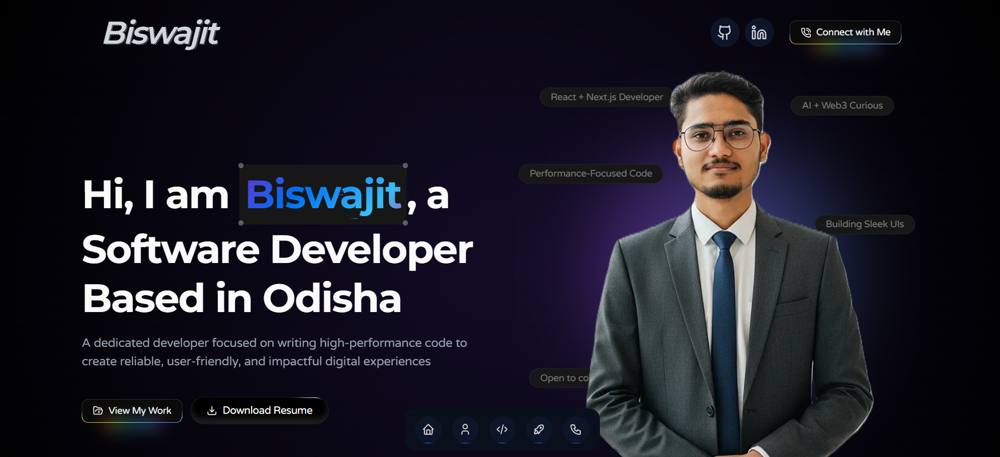

# My Personal Portfolio Website


This is the repository for my personal portfolio website, designed to showcase my skills, projects, and professional journey as a Fullstack Developer. It's built with modern technologies to be fast, responsive, and visually engaging.

**Live Site URL:** [**your-live-url.vercel.app**](https://your-live-url.vercel.app) ---

## ## Features

- **Modern & Responsive Design:** A clean, dark-themed UI that looks great on all devices, from mobile phones to desktops.
- **Smooth Animations:** Built with Framer Motion to provide a fluid and engaging user experience with orchestrated, on-scroll animations.
- **Interactive Elements:** Features like a 3D interactive globe, animated project cards, and a floating navigation dock make the site fun to explore.
- **Functional Contact Form:** An integrated contact form using EmailJS that allows visitors to get in touch with me directly.
- **Dynamic "Load More":** The projects section dynamically loads more items without a page refresh.

---

## ## Tech Stack

This project was built using a modern, full-stack tech stack:

- **Framework:** [Next.js](https://nextjs.org/) (React)
- **Styling:** [Tailwind CSS](https://tailwindcss.com/)
- **Animations:** [Framer Motion](https://www.framer.com/motion/)
- **UI Components:**
  - [Magic UI](https://magicui.design/)
  - [Aceternity UI](https://ui.aceternity.com/)
- **Icons:** [Lucide React](https://lucide.dev/) & [React Icons](https://react-icons.github.io/react-icons/)
- **Deployment:** [Vercel](https://vercel.com/)

---

## ## Getting Started

To run this project locally on your machine, follow these steps:

### ### Prerequisites

Make sure you have Node.js (version 18.x or higher) and npm installed.

### ### Installation

1.  **Clone the repository:**

    ```bash
    git clone [https://github.com/your-username/your-repo-name.git](https://github.com/your-username/your-repo-name.git)
    cd your-repo-name
    ```

2.  **Install dependencies:**

    ```bash
    npm install
    ```

3.  **Set up environment variables:**
    Create a `.env.local` file in the root of the project and add your EmailJS credentials:

    ```env
    NEXT_PUBLIC_EMAILJS_SERVICE_ID="your_service_id"
    NEXT_PUBLIC_EMAILJS_TEMPLATE_ID="your_template_id"
    NEXT_PUBLIC_EMAILJS_PUBLIC_KEY="your_public_key"
    ```

4.  **Run the development server:**
    ```bash
    npm run dev
    ```

Open [http://localhost:3000](http://localhost:3000) with your browser to see the result.

---

## ## Acknowledgements

A huge thanks to the creators of **Magic UI** and **Aceternity UI** for their incredible open-source components, which helped bring this portfolio's design to life.
